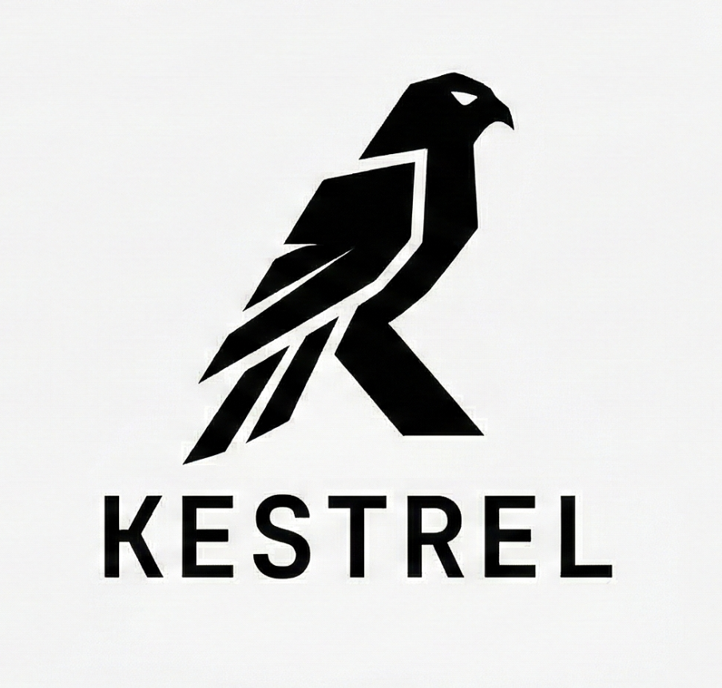

<div align="center">



**The Mac toolbar for developers**

[](LICENSE)
[](https://www.apple.com/macos/sonoma/)
[](https://swift.org)
[](https://github.com/alilibx/kerstel/releases)

System metrics, port management, and AI usage tracking — all from your menu bar. No Electron. No web views. No telemetry. Just Swift.

[Install](#install) · [Features](#features) · [AI Usage](#ai-usage) · [CLI](#cli) · [Build from source](#build-from-source) · [Contributing](#contributing)

</div>

---

## Install

```bash
curl -fsSL https://kerstel.dev/install.sh | bash
```

Clones the repo, builds a release binary, creates a `.app` bundle in `~/Applications`, and sets up a launch agent to start on login. The **K** icon appears in your menu bar immediately — and Kerstel shows up in Spotlight.

> **Requirements:** macOS 14 (Sonoma) or later · Swift (ships with [Xcode Command Line Tools](https://developer.apple.com/xcode/resources/))

## Features

| | Feature | Details |
|---|---------|---------|
| 🧠 | **Memory** | Total, used, free, active, wired, compressed, cached — with a usage bar |
| ⚡ | **CPU** | User / system / idle %, 1/5/15 min load averages, chip name |
| 💾 | **Disk** | Total / used / free GB, capacity percentage |
| 🎮 | **GPU** | Chip name, core count, Metal version, VRAM |
| 🔋 | **Battery** | Charge %, power source, charging state, time remaining |
| 📊 | **Processes** | Top 5 by CPU or memory — name, PID, usage. Kill with one click |
| 🌐 | **Ports** | Listening TCP ports — port, process name, full path, PID. Kill with one click |
| 🧹 | **Cleanup** | Purge memory, clear user caches, flush DNS (requests admin) |
| 🤖 | **AI Usage** | Track Claude, Cursor, and Codex quotas — plan, usage %, reset date |

Four tabs: **Overview** (dashboard), **System** (detailed metrics), **Ports**, and **AI Usage**. System metrics refresh every 4 seconds. AI usage refreshes every 60 seconds.

## AI Usage

Kerstel tracks your AI coding tool quotas so you always know where you stand:

- **Claude** — reads `~/.claude/.credentials.json`, calls the Anthropic usage API
- **Cursor** — reads Cursor's session from Application Support, calls the Cursor usage API
- **Codex** — reads `~/.codex/auth.json`, calls the OpenAI usage API

Each provider shows: plan name, usage percentage with a color-coded progress bar, request counts, and reset date. Providers that aren't installed or authenticated are shown with a dimmed status.

## CLI

The installer adds a `kerstel` command to your PATH:

```bash
kerstel open          # Launch the menu bar app
kerstel stop          # Stop the app
kerstel restart       # Restart the app
kerstel status        # Check if it's running
kerstel update        # Pull latest version, rebuild, restart
kerstel version       # Show installed version
kerstel uninstall     # Remove everything
kerstel help          # Show all commands
```

> Closed the app by accident? Just run `kerstel open` or search "Kerstel" in Spotlight.

## Build from source

```bash
git clone https://github.com/alilibx/kerstel.git
cd kerstel
swift build -c release
.build/release/Kerstel
```

## Run tests

```bash
swift test
```

<details>
<summary>Command Line Tools only (no Xcode)?</summary>

```bash
DYLD_FRAMEWORK_PATH=/Library/Developer/CommandLineTools/Library/Developer/Frameworks \
swift test \
  -Xswiftc -F/Library/Developer/CommandLineTools/Library/Developer/Frameworks \
  -Xlinker -rpath -Xlinker /Library/Developer/CommandLineTools/Library/Developer/Frameworks
```

</details>

## Project structure

```
Sources/
├── Kerstel/                  # Executable entry point
│   └── main.swift
├── KerstelCore/              # Library — all app logic
│   ├── AppDelegate.swift     # Menu bar setup, popover, timers
│   ├── IconGenerator.swift   # Draws the "K" icon
│   ├── Models/
│   │   ├── SystemMetrics.swift   # System data structs, AppTab enum
│   │   └── AIUsageModels.swift   # AI provider models and state
│   ├── Services/
│   │   ├── ShellExecutor.swift   # Shell command abstraction
│   │   ├── MetricsCollector.swift
│   │   ├── PortManager.swift
│   │   ├── CleanupService.swift
│   │   ├── ProcessManager.swift
│   │   └── AIUsageService.swift  # Claude, Cursor, Codex API client
│   └── Views/
│       ├── StatusBarView.swift   # Root view with 4-tab navigation
│       ├── OverviewView.swift    # Dashboard with metric cards
│       ├── AIUsageView.swift     # AI provider usage list
│       ├── CPUView.swift
│       ├── MemoryView.swift
│       ├── DiskView.swift
│       ├── GPUInfoView.swift
│       ├── BatteryView.swift
│       ├── ProcessListView.swift
│       ├── PortsView.swift
│       ├── CleanupView.swift
│       └── Components/
│           ├── TabBarView.swift      # 4-tab icon bar
│           ├── OverviewCard.swift    # Dashboard metric card
│           ├── AIProviderCard.swift  # AI provider status card
│           ├── MetricProgressBar.swift
│           └── SectionHeader.swift
Resources/
├── Info.plist                # App bundle metadata
└── AppIcon.icns              # App icon for Spotlight/Finder
Tests/
└── KerstelTests/             # Tests with mock shell fixtures
```

## Update

```bash
kerstel update
```

Or manually:

```bash
cd ~/.kerstel && git pull && swift build -c release
```

## Uninstall

```bash
kerstel uninstall
sudo rm /usr/local/bin/kerstel
```

## Contributing

Contributions are welcome! Here's how:

1. Fork the repo
2. Create a feature branch (`git checkout -b feature/my-feature`)
3. Make your changes
4. Run the tests (`swift test`)
5. Commit (`git commit -m 'Add my feature'`)
6. Push (`git push origin feature/my-feature`)
7. Open a Pull Request

Please keep PRs focused — one feature or fix per PR.

## License

[MIT](LICENSE) — free to use, modify, and distribute.

---

<div align="center">

Built with Swift on macOS.

**[kerstel.dev](https://kerstel.dev)**

</div>
